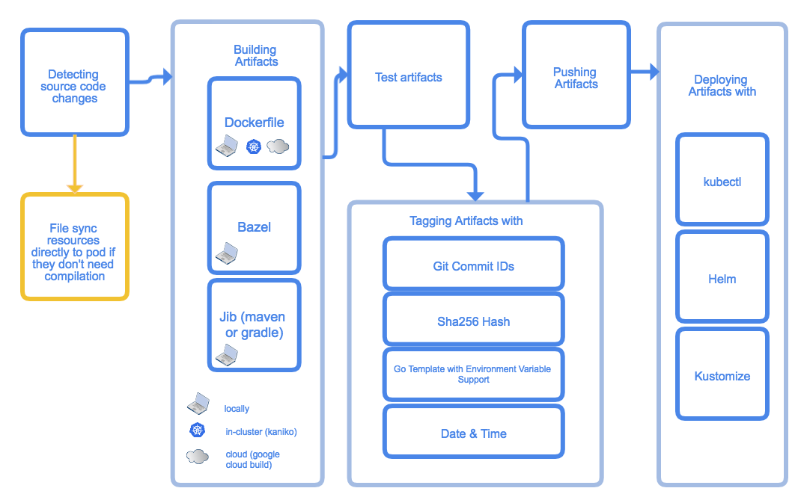

# skaffold
## Introduction
**Skaffold** is a command line tool that facilitates continuous development for Kubernetes applications. You can iterate on your application source code locally then deploy to local or remote Kubernetes clusters. Skaffold handles the workflow for building, pushing and deploying your application. It also provides building blocks and describe customizations for a CI/CD pipeline - for more details https://skaffold.dev/docs/

## Getting Started
* Install Docker - https://www.docker.com/get-started 
* Install kubectl - https://kubernetes.io/docs/tasks/tools/install-kubectl/ 
* Install Minikube - https://kubernetes.io/docs/tasks/tools/install-minikube/ 
* Install skaffold - https://skaffold.dev/docs/getting-started/#installing-skaffold 

## Workflows
### example1
- Building a single go file app and with a multistage Dockerfile using local docker to build
- Tagging using the default tagPolicy (gitCommit)
- Deploying a single container pod using kubectl
### example2
- Building a single go file app using kaniko and Minikube
- Tagging using the default tagPolicy (gitCommit)
- Deploying a single container pod using kubectl